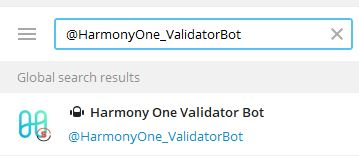
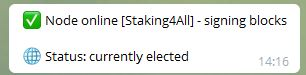

# harmony-one-validator-delegator-bot
Harmony One Bot that helps monitor validator nodes and also delegators delegations

# Overview
This is a telegram bot that allows you to register Harmony One validator addresses and delegator addresses, the bot will then notify you of important changes.

## Setting up the bot

With telegram you must find the bot using @HarmonyOne_ValidatorBot

You can then click on start to activate the bot

Then the bot menu will be displayed. The menu allows the following
- Add  - this opens a menu that allows you to add validators or delgator wallets
- List - this lists information of validators and delegators you have added
- Faucet - Only available on pen staking testnet, will provide you will testnet ONE tokens

## Adding delegator wallets or validators

By clicking the "Add" button on the main menu you will have a sub menu where you can validators and delegators. Follow the prompts

## List info

Using the list sub menu you can list information about delegators or validators

## Information Available

The bot provides rich information to ensure you are fully aware of how your delegations on validators are performing or as a validator what is your node status. The information also provides information related to rewards in relation to the median vote which in turn impact rewards.

#### Example of delegator info

#### Example of validator info

## Alerts
The bot provides several alerts that includes
- Validator fee change
- Validator stop signing and missing blocks/signing
- Validator has fallen out of the committee
- Open Staking TestNet resets

#### Example of node returning into committee alert

#### Example of node missing signing/blocks alerts

#### Example of node changing fee % and informing delegator

